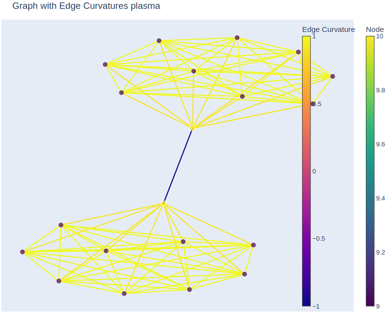

## Graph Curvature Analysis and Visualization


## Description


## Plots
The following plots are generated by the code in this repository. It shows two fully connected graphs
connected to each other by a single edge. The curvature on the edges of the clusters are positive yet the
curvature on the edge connecting the two clusters is negative.

```python
from graph_analysis import balanced_forman_curvature_sparse
import networkx as nx
from plotly_visualize import visualize_graph
import random


# Create two complete graphs
n1 = 10  # Number of nodes in the first complete graph
n2 = 10  # Number of nodes in the second complete graph
G1 = nx.complete_graph(n1)
G2 = nx.complete_graph(n2)

# Relabel nodes in G2 to avoid overlap with G1
mapping = {i: i + n1 for i in G2.nodes()}
G2 = nx.relabel_nodes(G2, mapping)

# Combine the two graphs
G = nx.compose(G1, G2)

# Add more random edges between the two graphs
num_additional_edges = 1  # Number of additional edges to add
for _ in range(num_additional_edges):
    node_from_G1 = random.choice(list(G1.nodes()))
    node_from_G2 = random.choice(list(G2.nodes()))
    G.add_edge(node_from_G1, node_from_G2)

C = balanced_forman_curvature_sparse(G)

edge_curvatures = {}
for u, v in G.edges():
    # For undirected graphs, ensure consistent ordering
    curvature = C[u, v] if (u, v) in G.edges else C[v, u]
    edge_curvatures[(u, v)] = curvature
    print(f"Curvature between nodes {u} and {v}: {curvature}")

visualize_graph(G, edge_curvatures,
                    node_size=10,
                    cmap='plasma',
                    layout="graphviz",
                    title=f"Graph with Edge Curvatures",
                    filename="graph.html")

```




## Installation

```
 sudo apt-get install graphviz libgraphviz-dev pkg-config
```


